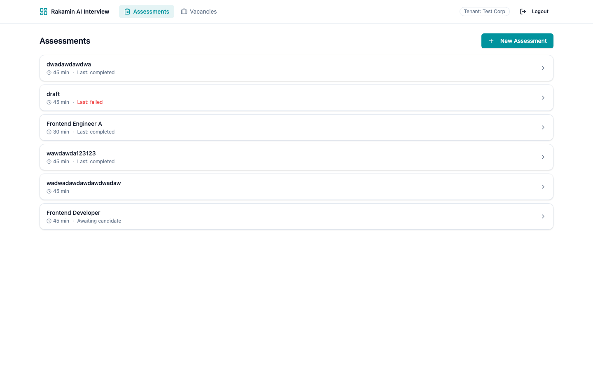
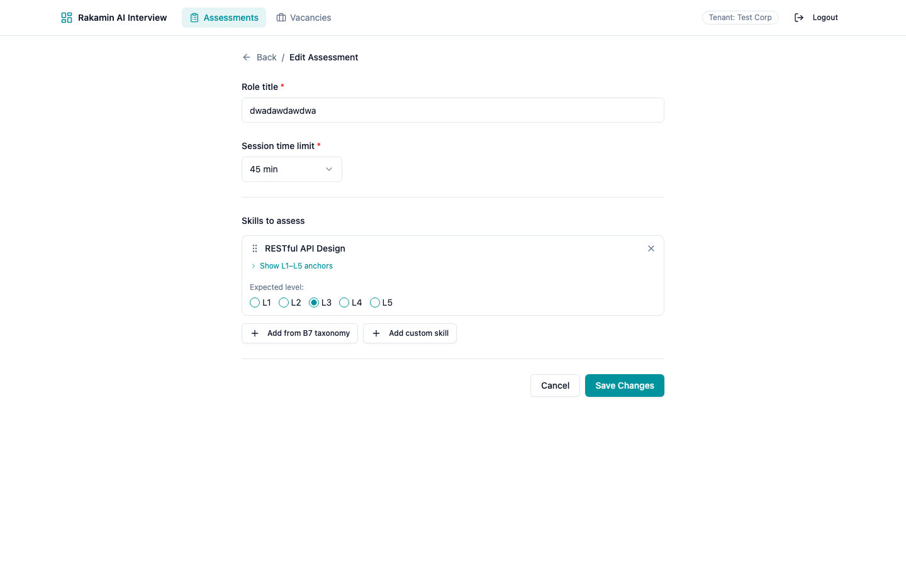
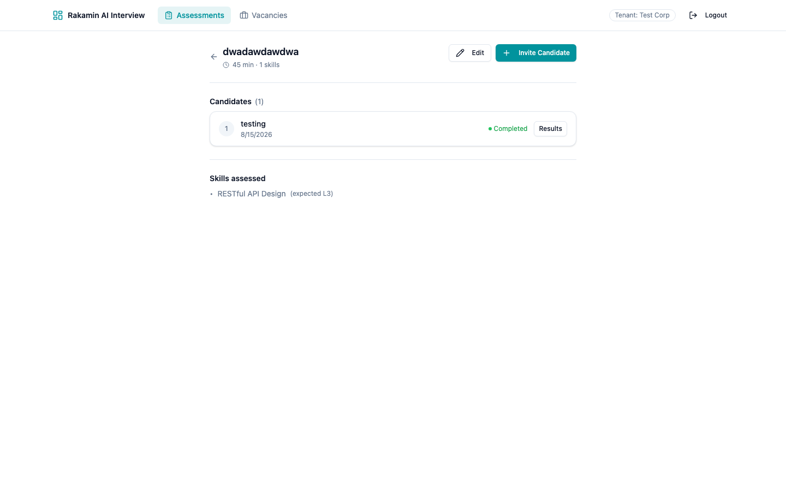
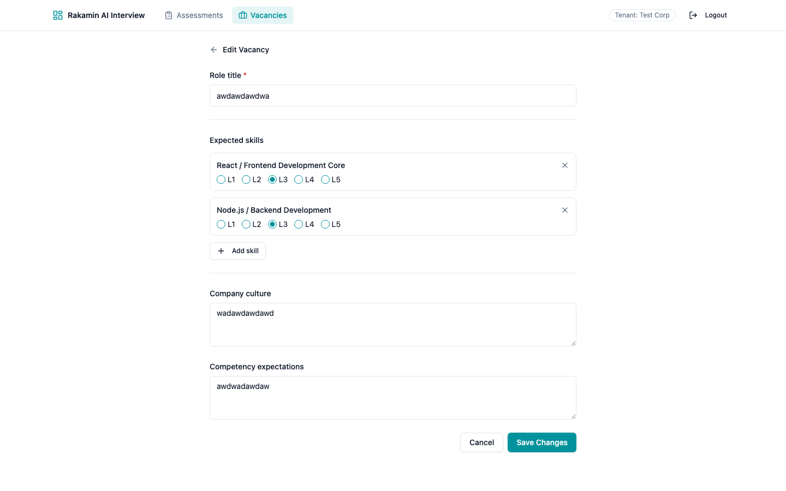
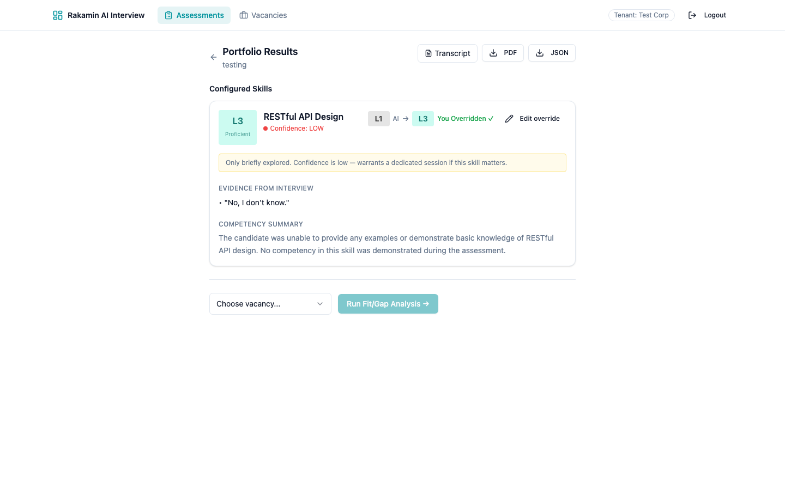
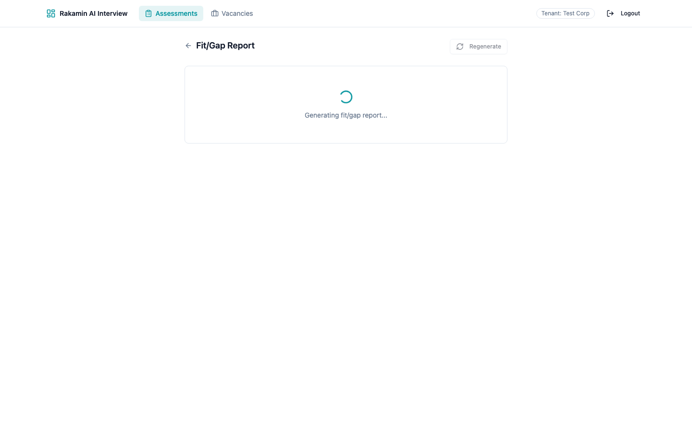
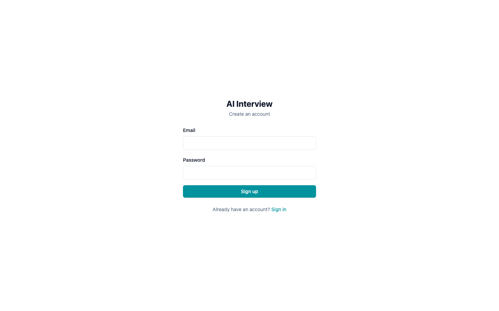
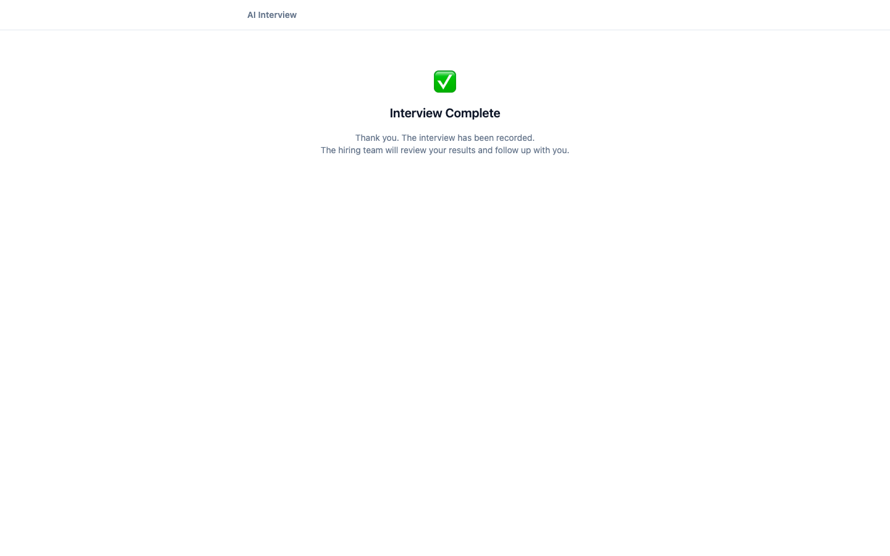

# Studi Kasus — Fullstack Product Engineer

**AI Interview Platform** — perbaikan keamanan data kandidat & keandalan sesi interview end-to-end

- **Branch:** `fix/p0-cross-tenant-idor`
- **PR:** (link PR / fork yang dikirim)
- **Video walkthrough (3–5 menit):** (link Loom/YouTube/Drive)
- **Tanggal:** Sabtu, 15 Agustus 2026

---

## 1. Understanding (2–3 kalimat)

AI Interview Platform adalah produk penilaian kandidat untuk industri **hiring & talent assessment di Indonesia**, tempat perusahaan (tenant) merekrut kandidat melalui wawancara berbasis AI: kandidat diwawancarai oleh asisten AI (Gemini Live) dan dievaluasi otomatis menjadi *skill portfolio* dan *fit/gap report* terhadap lowongan kerja. Tujuannya adalah memangkas biaya dan waktu screening awal — dari proses manual berhari-hari menjadi otomatis dalam hitungan menit — dengan dua kelompok pengguna utama: **assessor/recruiter** (yang menyusun asesmen, mengundang kandidat, dan meninjau laporan) dan **kandidat** (yang mengikuti sesi lewat tautan undangan tanpa akun). Karena menangani data pribadi kandidat (rekaman sesi, transkrip, hasil penilaian), produk harus patuh pada prinsip **UU Perlindungan Data Pribadi** — data hanya boleh diakses oleh pihak yang berwenang dan tidak boleh bocor lintas tenant.

## 2. Identifikasi Problem Gap

Produk ini multi-tenant (satu aplikasi dipakai banyak perusahaan), tetapi **seluruh lapisan data tidak mengikat akses ke tenant yang sedang aktif**. Gap ini dikategorikan berdasarkan keparahan:

### P0 — Cross-Tenant IDOR (data kandidat bocor antar-perusahaan) — *constraint signal*

Beberapa endpoint mengambil record hanya berdasarkan `id` tanpa memfilter `tenant_id` sesi:

- `Portfolio.find(params[:id])` — `GET/POST` pada portfolio, fit/gap report, regenerasi.
- `PortfolioSkill.find(params[:id])` — override keyakinan skill.
- `FitGapReport.find_by(portfolio_id:, vacancy_id:)` — report lintas tenant.

Seorang assessor tenant A yang menebak/mendapatkan `id` milik tenant B dapat **membaca dan memodifikasi portfolio, mengubah penilaian skill (override), dan menarik report fit/gap** kandidat perusahaan lain. Ini pelanggaran UU PDP dan **constraint signal**: produk tidak layak dirilis multi-tenant selama ada satu endpoint yang bisa menembus isolasi data. Mode demo satu-tenant menyembunyikan masalah ini.

### P1 — Keandalan & pengalaman pengguna

- **Sesi interview mati ~8 detik** saat WebSocket Gemini live tertutup (`close 1007`) dan 3× percobaan reconnect (1+2+4 detik) gagal → sesi berakhir dengan `end_reason: "error"` tanpa pesan yang dapat ditindaklanjuti; tidak ada jalur *fallback* bagi kandidat untuk mengakhiri sesi jika WebSocket mati (kandidat tidak punya JWT).
- **Autentikasi setelah tenant**: token tidak valid menjawab `403 Tenant not found` (karena referer tidak terselesaikan) alih-alih `401` — kesalahan urutan *middleware*.
- **Fit/gap report 404** saat report belum dibuat — klien tidak punya cara membedakan "belum ada" vs "error".
- **Override 404 buntu**: setelah portfolio diregenerasi, id skill berubah (dihapus+di-recreate), sehingga tombol override lama melempar 404 dan UI macet di halaman error.
- **Speed test bergantung host eksternal** (httpbin/postman-echo) yang flaky (503/504) — mengganggu alur pra-interview.
- **Tidak ada jalur self-signup assessor** (role di-encode hanya `admin`); kolaborasi assessor tidak mungkin.

### P2 — Konfigurasi & dokumentasi

- Default model Gemini masih `gemini-2.0-*` yang sudah tidak tersedia (404/400) untuk key yang dipakai — berpotensi gagal saat env tidak di-set.
- `APP_BASE_URL` di dokumentasi menunjuk API (port 3001) padahal tautan undangan harus menuju frontend.

### P3 — Housekeeping

- Baris kode mati / variabel tak terpakai (rubocop) dan komentar konfigurasi menyesatkan.

### Klasifikasi: Missing Specification vs Defective Implementation

Sesuai brief, setiap gap dipisahkan mana yang aturannya belum pernah didefinisikan, mana yang aturannya ada tapi implementasinya rusak:

| Temuan | Jenis | Alasan |
|---|---|---|
| Cross-tenant IDOR (P0) | **Defective implementation** | Multi-tenant sudah menjadi desain produk, tapi lookup `Portfolio.find(id)` tidak menghormatinya. |
| Sesi `end_reason: error` saat WebSocket mati (P1) | **Missing specification** | Tidak ada aturan apa yang terjadi bila Gemini WS tertutup / kandidat tak punya jalur mengakhiri sesi. |
| Fit/gap 404 saat report belum ada (P1) | **Missing specification** | Tidak didefinisikan perilaku klien saat report belum di-generate (get-or-create → `202`). |
| Override 404 buntu saat skill stale (P1) | **Missing specification** | Tidak ada aturan frontend saat id skill berubah setelah regenerasi. |
| Speed test 503/504 (P1) | **Defective implementation** | Mengandalkan host eksternal flaky; seharusnya memakai infrastruktur sendiri. |
| Auth 403 "Tenant not found" untuk token invalid (P1) | **Defective implementation** | Urutan middleware salah — autentikasi harus dijalankan sebelum resolusi tenant. |
| Default model `gemini-2.0-*` mati (P2) | **Missing specification** | Konfigurasi model tidak pernah divalidasi terhadap ketersediaan API. |

## 3. Strategi Revamp (2–3 Opsi + Trade-off)

**Tujuan:** isolasi data per-tenant yang kokoh (P0), keandalan sesi kandidat (P1), tanpa menyulitkan endpoint publik berbasis token undangan (tanpa JWT).

### Opsi A — Lapisan scoping terpusat (concern `TenantScopedBySession`) — **diimplementasikan**

Menambahkan `include TenantScopedBySession` + scope `for_tenant(tenant_id)` pada semua model milik tenant, lalu semua lookup di controller diarahkan lewat scope tersebut. *Trade-off:* dampak luas dan butuh disiplin — setiap lokasi lookup baru wajib memakai scope; ada risiko titik lookup terlewat. **Mitigasi:** spec negatif cross-tenant untuk setiap modul (lihat Seeded Fault Test) sehingga regresi tertangkap CI. **Produk & biaya:** satu titik aturan, biaya perawatan rendah setelah dibangun. **Mode kegagalan:** jika scope hilang, spec langsung merah.

### Opsi B — Filter per-controller (minimal)

Menambahkan `where(tenant_id:)` di tiap endpoint yang bermasalah. *Trade-off:* cepat dan lokal, tapi **tidak defense-in-depth** — mudah tidak konsisten antar-endpoint, dan pengembang baru bisa melewatkannya tanpa penjaga. *Mode kegagalan:* isolasi kembali bocor diam-diam di endpoint baru.

### Opsi C — Restrukturisasi routing + tenant middleware

Merombak menjadi *namespaced resources* di bawah scope tenant + middleware tenant di level routing. *Trade-off:* paling kokoh secara arsitektur, tetapi refactor invasif tinggi, berisiko besar terhadap endpoint kandidat tanpa JWT, dan menyentuh seluruh konsumen API — biaya tinggi dengan nilai tambah terbatas untuk skala produk ini. *Mode kegagalan:* regresi luas yang sulit di-debug di tengah tenggat.

**Keputusan:** Opsi A — concern + scope + spec negatif, plus validasi di controller. Memberikan isolasi terpusat yang bisa dibuktikan otomatis, dengan biaya sebanding dengan skala produk.

## 4. Kriteria Penerimaan (self-defined)

Disusun format Given/When/Then agar dapat diuji, dengan edge case eksplisit.

**AC-1 — Isolasi data lintas tenant (P0)**
- *Given* assessor terautentikasi milik tenant A, dan *when* ia meminta (GET/POST) portfolio, portfolio skill, atau fit/gap report milik tenant B (id ditebak),
- *Then* respons selalu `404` — tidak pernah `200/201/202` — untuk read maupun write.
- *Edge:* id yang tidak ada → `404`; id milik tenant sendiri → normal.

**AC-2 — Urutan autentikasi**
- *Given* request tanpa token, *when* diarahkan ke endpoint assessor,
- *Then* jawaban `401` (bukan `403 Tenant not found`); role non-assessor → `403`.

**AC-3 — Sesi kandidat bisa berakhir walau WebSocket mati**
- *Given* sesi interview aktif dan WebSocket Gemini sudah putus, *when* kandidat memanggil `POST /sessions/:token/end` (tanpa JWT),
- *Then* sesi berakhir idempotent (`reason: manual_candidate`); memanggil ulang tidak error; jawaban kandidat tidak hilang.

**AC-4 — Fit/gap get-or-create**
- *Given* portfolio lengkap tapi report belum ada, *when* `GET /portfolios/:id/fitgap/:vacancy_id`,
- *Then* generasi di-antri dan respons `202 {status:"generating"}`; polling berikutnya `200` dengan report.
- *Edge:* `vacancy_id` kosong → `422`; vacancy tidak ada → `404`; portfolio belum complete → `422`; portfolio tenant lain → `404`.

**AC-5 — Override skill yang stale**
- *Given* portfolio sudah diregenerasi sehingga id skill lama tidak valid, *when* assessor menyimpan override,
- *Then* `404` dari API memicu refetch portfolio di frontend (bukan halaman error); override sukses → `200` + UI ter-update.

**AC-6 — Speed test lokal**
- *Given* kandidat menjalankan pre-interview check, *when* upload diukur,
- *Then* upload dikirim ke endpoint backend sendiri; endpoint non-2xx tidak pernah dihitung sebagai kecepatan palsu; tanpa jaringan → `passed: false`.

**AC-7 — Kualitas & CI**
- *Given* push / PR, *then* CI hijau: RSpec ≥ 80 contoh (saat ini 83), Rubocop `--lint` 0, web typecheck+build+unit test (saat ini 10) — gagal bila ada yang merah.

## 5. Perubahan Full-Stack

Penamaan fitur tetap sesuai produk asli (`portfolio`, `portfolio_skill`, `fit_gap_report`, `session`).

### Backend (Rails API)

- **P0 — isolasi data:** concern baru `api/app/models/concerns/tenant_scoped_by_session.rb` mengekspos `for_tenant(tenant_id)` lewat traversal relasi (`portfolio: :session`); diterapkan ke `Portfolio`, `PortfolioSkill`, `FitGapReport`. Semua lookup controller diarahkan ke scope tersebut.
- **Auth ordering:** `authorize_auth_token!` kini `prepend_before_action` sehingga 401/403 diputus sebelum `require_tenant!` (application_controller.rb).
- **Sesi kandidat:** `POST /sessions/:token/end` (`candidate_end`) memakai token undangan di URL, idempoten, memanggil `Sessions::EndHandler` — fallback saat WebSocket mati.
- **Audio resilience:** `audio_websocket_middleware.rb` & `gemini/live_client.rb` menutup sesi dengan rapi saat reconnect habis, bukan menggantung.
- **Fit/gap get-or-create:** `show_fitgap` mengecek kelengkapan portfolio, enqueue `FitGapGeneratorWorker`, dan balas `202 {status: "generating"}` bila report belum ada; `422` saat portfolio belum siap / `vacancy_id` kosong.
- **Regenerasi:** diizinkan saat portfolio `pending/generating/failed` (macet dari worker crash), ditolak hanya saat `complete`.
- **Auth baru:** `POST /auth/signup` membuat akun `assessor`; role klien (`admin`) tidak pernah dihormati (guard privilege escalation). Login menerima `admin|assessor`.
- **Speed test:** endpoint upload lokal `/api/v1/speed_test` (bukan host eksternal).
- **CI:** `.github/workflows/ci.yml` — `rails db:prepare`, RSpec, RuboCop `--lint`; web `npm ci` + build + lint.

### Frontend (React + TypeScript)

- **Interview:** `useAudioWebSocket.ts` & `InterviewPage.tsx` — jatuh ke `candidate_end` bila WebSocket gagal; state error jelas; polling report.
- **Fit/gap:** `services/portfolios.ts` mengetik union `{report} | {status:"generating"}`; `FitGapReportPage.tsx` menangani `202` (menampilkan status "generating") dan `404`.
- **Override:** `OverridePanel.tsx` / `SkillPortfolioCard.tsx` menerima `onStale` → `PortfolioPage.tsx` refetch portfolio saat `404` (tidak macet).
- **Auth UI:** halaman signup/login untuk assessor.
- **Console:** hapus skill di asesmen (destroy), tautan undangan dibangun dari `window.location.origin` (bukan hardcode), speed test lokal.
- **Polished states:** loading skeleton, pesan error yang dapat ditindaklanjuti, status kosong.

## 6. Keamanan Data & Kepatuhan (UU PDP)

- Tidak ada data kandidat (transkrip, rekaman, penilaian) yang di-log atau di-commit.
- **Tidak ada secret yang di-commit:** `api/config/application.yml` (berisi `GEMINI_API_KEY`) di-gitignore; hanya `.sample` yang di-versi-kontrol (nilai dummy).
- Isolasi per-tenant (P0) = kontrol akses wajib UU PDP (data hanya diakses yang berwenang).
- Endpoint publik (kandidat) hanya mengekspos data sesi lewat token undangan acak, bukan lewat id enumerable.

## 7. Bukti Implementasi

### Test & lint

```
$ bundle exec rspec
83 examples, 0 failures            # (3.48s)

$ bundle exec rubocop --lint
111 files inspected, no offenses detected

$ cd web && npm run build           # tsc && vite build
✓ built in 3.22s (1841 modules)

$ cd web && npm test                # Vitest
 Test Files  3 passed (3)
      Tests  10 passed (10)
```

### Seeded Fault Test (demo: test menangkap regresi)

Membuktikan spec tidak kosong — sengaja memasukkan kembali bug P0 dan menunjukkan CI menangkapnya:

1. **Baseline** — `spec/requests/portfolio_skills_controller_spec.rb` → `2 examples, 0 failures`.
2. **Tanam fault** — `set_portfolio_skill` dikembalikan ke `PortfolioSkill.find(params[:id])` (tanpa scope tenant).
3. **Hasil:** `1 failure` — *cross-tenant isolation ... expected 404 but it was 201* (override lintas tenant berhasil = data bocor).
4. **Revert fault** → spec hijau kembali, working tree bersih.

Output mentah saat fault ditanam:

```
$ bundle exec rspec spec/requests/portfolio_skills_controller_spec.rb
Randomized with seed 23892
F.

Failures:
  1) ... cross-tenant isolation blocks overriding a skill on another tenant portfolio
     Failure/Error: expect(response).to have_http_status(:not_found)
       expected the response to have a not_found status code (404) but it was 201
     # ./spec/requests/portfolio_skills_controller_spec.rb:20
...
2 examples, 1 failure

$ bundle exec rspec spec/requests/portfolio_skills_controller_spec.rb   # setelah revert
2 examples, 0 failures
```

Bukti video: fault test didemonstrasikan langsung (gagal → revert → hijau) pada segmen akhir video walkthrough.

### Momen AI Verification

Brief meminta minimal satu contoh di mana kode/saran AI terbukti **salah / risky**, kemudian ditinjau, dikoreksi, dan diuji. Berikut dua contoh nyata:

**Contoh 1 — Speed test mengandalkan host eksternal (risky)**
- **AI suggestion:** pengukuran upload via host echo pihak ketiga (`httpbin.org`, `postman-echo.com`).
- **Review:** dijalankan langsung → `httpbin`/`www.httpbin` menjawab `503`/`504`, dan karena `fetch` tetap resolve pada 503, kegagalan malah terukur sebagai *upload super-cepat* (hasil menyesatkan).
- **Issue:** dependensi third-party + pengukuran palsu.
- **Corrected:** upload dikirim ke endpoint backend sendiri `POST /api/v1/speed_test`; respons non-2xx tidak pernah dihitung.
- **Tested:** regression test di Vitest (`internetSpeedTest.test.ts`) membuktikan endpoint non-2xx menghasilkan `upload: 0`, bukan angka palsu.

**Contoh 2 — Default model Gemini (salah/tidak valid)**
- **AI suggestion:** memakai nama model `gemini-2.0-*` dari konfigurasi default (asumsi).
- **Review:** diverifikasi lewat `ListModels` API → model `2.0-*` sudah tidak tersedia (`404/400`) untuk key yang dipakai; `gemini-2.5-pro` "no longer available to new users".
- **Corrected:** `GEMINI_LIVE_MODEL=gemini-3.1-flash-live-preview`, `GEMINI_FLASH_MODEL=gemini-flash-latest`, `GEMINI_PRO_MODEL=gemini-3.5-flash`.
- **Tested:** handshake WebSocket Live (`setupComplete`) sukses + uji WS proxy menghasilkan `{"type":"transcription","speaker":"ai","text":"Hi there, thanks for coming in — ..."}` — pipeline interview AI benar-benar hidup.

**Verifikasi end-to-end lain:** portfolio lengkap → fit/gap `200`; report belum ada → `202` + generasi otomatis.

### Konfigurasi model yang diperbaiki

Model `gemini-2.0-*` sudah tidak tersedia untuk key yang dipakai; diperbarui ke model yang terverifikasi lewat API:
`GEMINI_LIVE_MODEL=gemini-3.1-flash-live-preview`, `GEMINI_FLASH_MODEL=gemini-flash-latest`, `GEMINI_PRO_MODEL=gemini-3.5-flash`.

### Frontend unit test (test runner baru)

Web awalnya tidak punya test runner. Ditambahkan **Vitest + Testing Library** (jsdom), 10 test hijau:

```
$ cd web && npm test
 Test Files  3 passed (3)
      Tests  10 passed (10)
```

- `utils/internetSpeedTest.test.ts` — upload ke endpoint lokal, non-2xx = gagal jujur, network down = tidak lolos.
- `services/portfolios.test.ts` — kontrak `getFitGap` (envelope `{report}` vs `{status:"generating"}`), endpoint override.
- `components/portfolio/OverridePanel.test.tsx` — `404` memicu `onStale` (refetch), `5xx` menampilkan error retry, sukses memanggil `onSaved`.

CI frontend kini menjalankan `npm test` (selain typecheck+build).

## 8. Commit Log (8 commit tematik)

| Commit | Isi |
|---|---|
| `5961d91` | fix: P0 cross-tenant IDOR — tenant-scoped lookups + auth ordering |
| `48ed59d` | fix: candidate session flow — JWT-free end fallback + audio resilience |
| `3325ab2` | fix: portfolio/fitgap — get-or-create report + override resilience |
| `a3485b0` | feat: auth — assessor self-signup + login |
| `3171a6e` | feat(web): console flows — skill destroy, invite links, local speed test |
| `18a102a` | test: RSpec suite (83 examples) + GitHub Actions CI |
| `a50a91c` | chore: app routing tweaks, gitignore for AI rule doc, web lockfile |
| `52b7c48` | test(web): Vitest runner + 10 unit/component tests, wire into CI |

## 9. Screenshot Lampiran

Semua screenshot diambil dari aplikasi yang berjalan (backend :3001 + web :5174), terautentikasi sebagai assessor.


**1. Dashboard assessor** — daftar asesmen.


**2. Form asesmen** — susun skenario & skill yang dinilai.


**3. Tautan undangan kandidat** — dibangun dari origin aplikasi.


**4. Edit lowongan kerja (vacancy)** — acuan fit/gap.


**5. Portfolio kandidat** (status complete) dengan tombol override level.


**6. Fit/Gap report** terhadap vacancy.


**7. Halaman signup assessor** — akun baru dibuat dengan role `assessor`.


**8. Halaman interview kandidat** (status ended) — jalur kandidat tanpa JWT.

## 10. Ringkasan Eksekutif

Produk sudah punya fondasi AI yang hidup, tetapi belum aman untuk dipakai multi-tenant. Perbaikan ini menghilangkan *constraint signal* P0 (IDOR lintas-tenant) lewat lapisan scoping terpusat yang dibuktikan 83 spec hijau + CI, sekaligus memperkuat keandalan sesi kandidat (fallback end, audio resilience), memperbaiki UX fit/gap & override, dan menghapus ketergantungan speed test pada host eksternal. Seluruhnya dilakukan sebagai 7 commit kecil yang readable dan siap di-review via PR.
